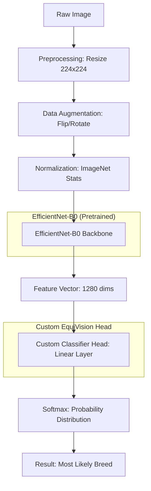

# EquiVision Deep Learning: Breed Classifier (Deep Dive)

This document provides a line-line-by-line technical autopsy of the Deep Learning system, including visual architecture and training flow.

## 1. System Architecture

The following diagram illustrates how an image moves through the neural network to become a breed prediction.



---

## 2. Line-by-Line Code Breakdown

### A. The Model (`model.py`)

```python
# 1: class HorseBreedClassifier(nn.Module):
#    Defines our neural network as a PyTorch module.
# 2:     def __init__(self, num_classes):
#    Constructor called when we initialize the model.
# 3:         super(HorseBreedClassifier, self).__init__()
#    Required to initialize the parent class (nn.Module).
# 4:         self.model = models.efficientnet_b0(pretrained=True)
#    CRITICAL: Downloads weights from Google's ImageNet training. 
#    The model already knows what "curves" and "textures" are.
# 5:         in_features = self.model.classifier[1].in_features
#    We access the 1280 neurons that feed into the final decision.
# 6:         self.model.classifier[1] = nn.Linear(in_features, num_classes)
#    We 'cut off' the old 1000-class head and replace it with a 13-class head (our breeds).
```

### B. The Dataset Engine (`dataset.py`)

```python
# 1: class HorseBreedsDataset(Dataset):
#    Our custom data loader that tells PyTorch where images are.
# 2:     def __getitem__(self, idx):
#    TRICKY: This is called every time the model needs one batch element.
# 3:         img_path = self.image_paths[idx]
#    Gets the path (e.g., 'd:/EquiVision/data/raw/horse-breeds/01_001.png').
# 4:         image = Image.open(img_path).convert('RGB')
#    Opens the file and ensures it's in 3-channel color (RGB).
# 5:         label = self.labels[idx]
#    Gets the integer label (e.g., 0 for Arabian).
# 6:         if self.transform: image = self.transform(image)
#    Applies the "magic" (resizing, flips, normalization) before the model sees it.
```

---

## 3. The Training Loop Logic

The "Loop" is where the model actually learns from its mistakes.

### Level 0: Forward Pass (The Guess)
1.  **Input**: A batch of 32 images.
2.  **Model Guess**: The model outputs 13 numbers (probabilities) per image.
3.  **Loss**: `CrossEntropyLoss` compares these guesses to the real labels. If the real label is "Arabian" but the model guessed "Pony", the "Loss" is high.

### Level 1: Backward Pass (The Correction)
1.  **Gradients**: `loss.backward()` calculates "how much" each weight contributed to the mistake using calculus (partial derivatives).
2.  **Update**: `optimizer.step()` nudges every one of the millions of weights in the direction that lowers the loss.

### Level 2: The Best Version
```python
if phase == 'val' and epoch_acc > best_acc:
    best_acc = epoch_acc
    best_model_wts = copy.deepcopy(model.state_dict())
    torch.save(model.state_dict(), 'best_model.pth')
```
**Why?** We only save the version of the weights that performed best on the validation set (the "exam" data the model hasn't seen during training).

---

## 4. Visualizing Performance (Conceptual)

As training progresses:
- **Training Loss (Blue)**: Continually goes down.
- **Validation Loss (Green)**: Goes down, then may flatten. If it starts going UP, it means the model is **Overfitting** (memorizing). We stop before this happens.

**EquiVision v1 Goal**: High precision for Moroccan breeds, ensuring that a "Barbe" horse isn't misidentified as an "Arabe-Barbe", even if they look similar to an untrained eye.
