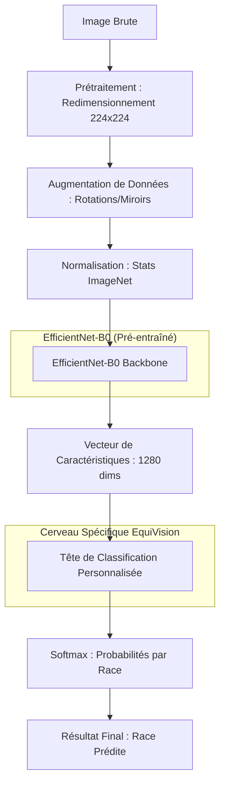

# EquiVision Deep Learning : Classificateur de Races de Chevaux (Détails Techniques)

Ce document propose une autopsie technique complète, ligne par ligne, du système de Deep Learning utilisé par EquiVision pour identifier les races de chevaux à partir d'images.

## 1. Architecture du Système (Vision Globale)

Le modèle s'appuie sur une architecture **EfficientNet-B0**, un réseau de neurones convolutif à la pointe de l'industrie, optimisé pour l'équilibre entre précision et légèreté.



---

## 2. Explication Ligne par Ligne du Code

### A. Le Modèle (`model.py`)

C’est ici que nous définissons la structure du « cerveau ».

```python
# 1: class HorseBreedClassifier(nn.Module):
#    Définit notre réseau comme un module PyTorch. C'est le conteneur principal.
# 4:     self.model = models.efficientnet_b0(pretrained=True)
#    IMPORTANT : Nous téléchargeons les poids pré-entraînés sur ImageNet. 
#    Cela signifie que le modèle sait déjà reconnaître des formes (yeux, oreilles, textures) 
#    avant même de voir son premier cheval.
# 5:     in_features = self.model.classifier[1].in_features
#    Nous récupérons les 1280 "neurones" de la dernière couche de décision d'EfficientNet.
# 6:     self.model.classifier[1] = nn.Linear(in_features, num_classes)
#    Nous remplaçons la "tête" générique par une nouvelle couche adaptée à nos 13 races spécifiques.
```

### B. Le Chargement des Données (`dataset.py`)

Comment le système transforme des fichiers images en mathématiques compréhensibles.

```python
# 1: class HorseBreedsDataset(Dataset):
#    Gère la lecture des fichiers sur le disque.
# 2:     def __init__(self, root_dir, transform=None):
#    Initialise le chemin vers les données et charge 'labels.json'.
# 4:     class_id = img_name.split('_')[0]
#    On extrait l'ID de la race directement du nom du fichier (ex: '01_001.png' -> '01').
# 5:     image = Image.open(img_path).convert('RGB')
#    Ouvre l'image et s'assure qu'elle est en mode 3 couleurs (Rouge, Vert, Bleu).
# 6:     if self.transform: image = self.transform(image)
#    Applique les transformations (Augmentation) avant de passer l'image au modèle.
```

---

## 3. Stratégie d'Entraînement (`pipeline.py`)

L'entraînement est le processus par lequel le modèle apprend de ses erreurs.

### Pourquoi le CrossEntropyLoss ?
Nous utilisons la **Perte d'Entropie Croisée**. Elle mesure la distance entre la prédiction du modèle (ex: 80% Arabe, 10% Barbe) et la réalité (100% Arabe). Plus l'erreur est grande, plus la punition mathématique est forte pour le modèle.

### Pourquoi l'Optimiseur Adam ?
**Adam** ajuste le "pas" d'apprentissage (Learning Rate) pour chaque poids du modèle. C'est comme descendre une montagne dans le brouillard : Adam ajuste la vitesse de chaque pas pour trouver le point le plus bas (l'erreur minimale) le plus rapidement possible.

### Le Cycle d'Apprentissage (Boucle For)
1.  **Forward Pass** : Le modèle fait une "supposition" sur un lot de 32 images.
2.  **Calcul du Loss** : On compare la supposition à la vérité.
3.  **Backward Pass** : Grâce au calcul différentiel, on remonte le réseau pour voir quels neurones sont responsables de l'erreur.
4.  **Optimization Step** : On modifie légèrement les poids des neurones pour que la prochaine supposition soit meilleure.

---

## 4. Visualisation de la Performance

Pendant l'entraînement :
-   **Précision (Accuracy)** : Elle doit monter sur les ensembles d'entraînement et de validation.
-   **Surapprentissage (Overfitting)** : Si la précision d'entraînement monte à 100% mais que la précision de validation stagne ou descend, le modèle a "mémorisé" les images au lieu d'apprendre à reconnaître les chevaux. EquiVision utilise la **validation croisée** pour éviter cela.

**Objectif EquiVision** : Garantir une fiabilité maximale pour les races marocaines (Barbe, Arabe-Barbe) qui partagent des caractéristiques morphologiques proches.
